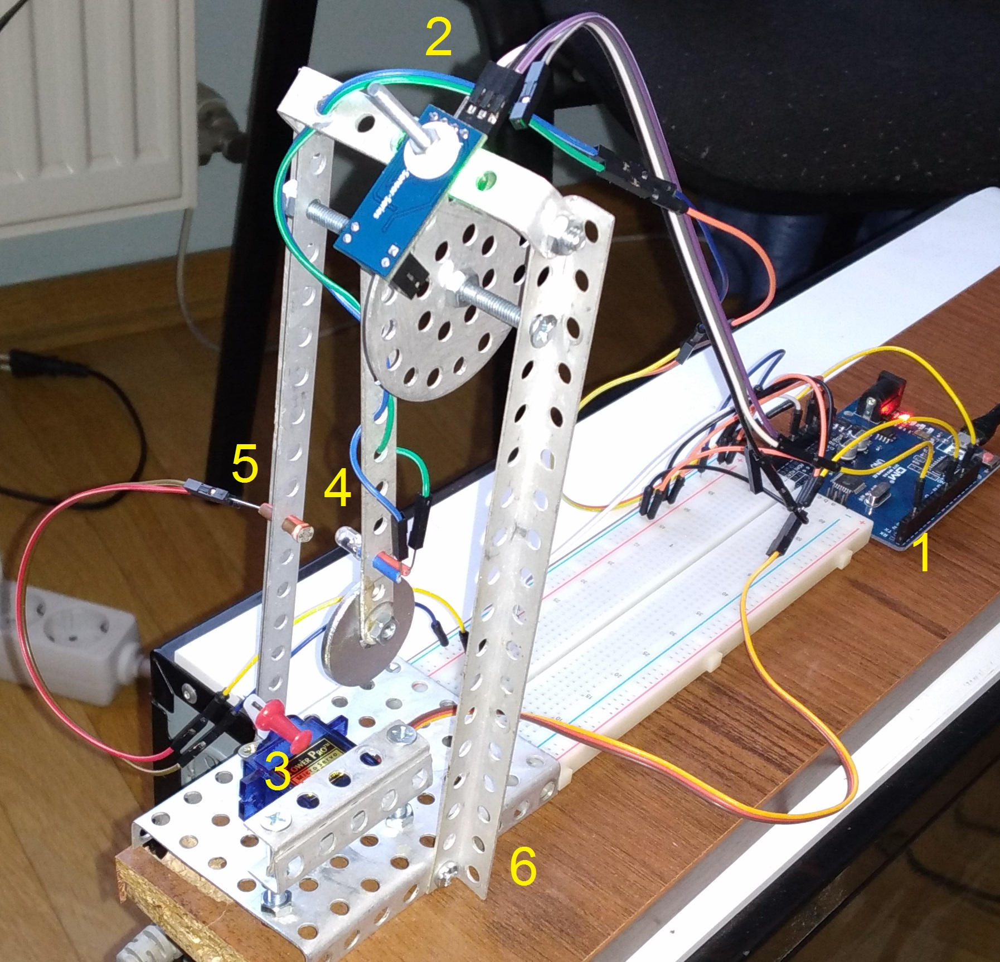

# mechatronics2
Маятник на Arduino - Modelica-модель і реалізація.

Вимоги для моделі:

1. OpenModelica 1.16.2
2. PlanarMechanics 1.4.1

Використані компоненти:

1. Arduino Uno
2. Енкодер LM393
3. Сервопривід SG90
4. Світлодіод
5. Фоторезистор
6. Деталі металевого конструктора
